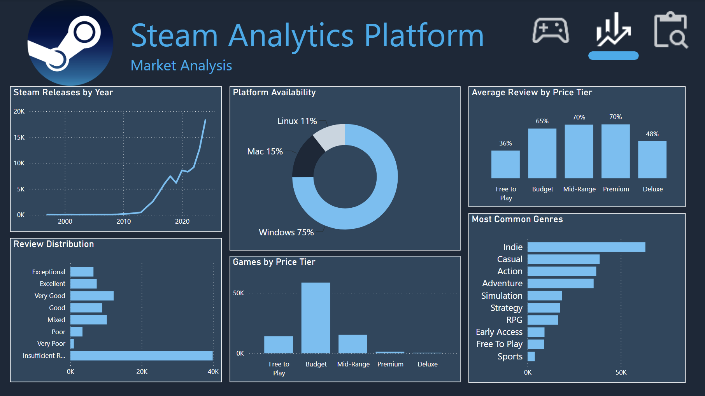
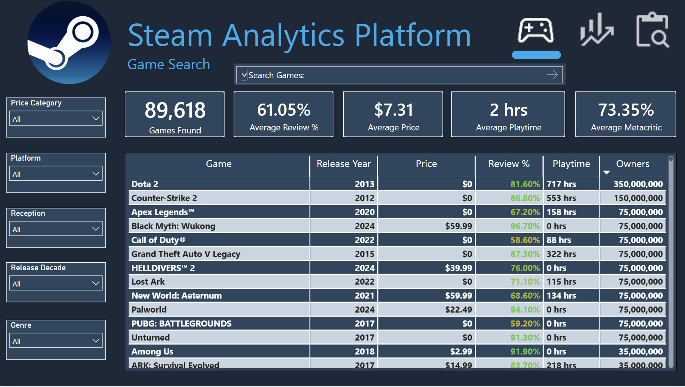
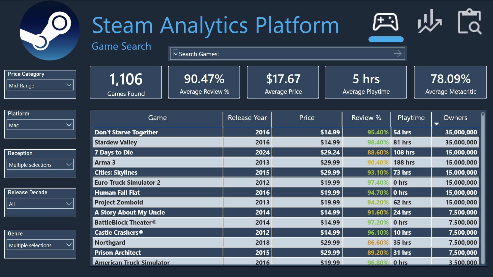
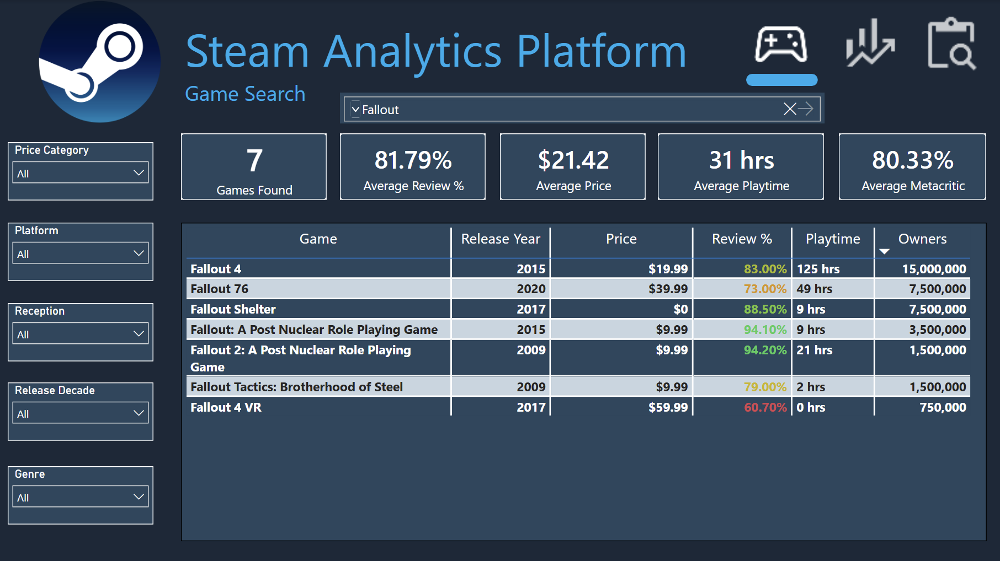
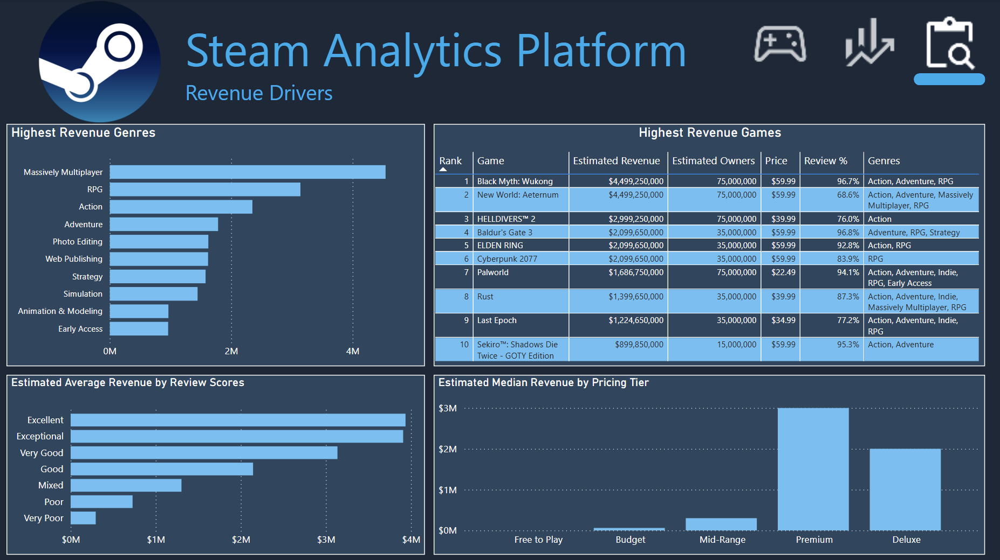

# 🎮 Steam Analytics Platform



An end-to-end analytics engineering project that transforms raw Steam game data into an analytics-ready dataset using a Medallion Architecture (Bronze → Silver → Gold), with automated profiling, data validation, and business-focused transformations.

The finished dataset powers SQL analytics and a three-page interactive Power BI dashboard for game discovery, market analysis, and revenue exploration.

---

## Project Goals

- Build a production-style ETL pipeline using Python and Pandas
- Implement a Medallion Architecture
- Validate data quality at every stage
- Create an analytics-ready semantic layer
- Load curated data into DuckDB
- Build an interactive Power BI dashboard for exploring Steam games

---

## Project Highlights

- 📊 Built an interactive Power BI dashboard analyzing nearly 90,000 Steam games
- 🧹 Cleaned and transformed raw Steam datasets using Power Query
- 🧩 Designed a star schema with supporting dimension tables for genres and platforms
- 📈 Developed custom DAX measures and calculated columns
- 🎮 Implemented interactive search, slicers, KPIs, and drill-down analytics
- 💰 Estimated game revenue using SteamSpy ownership ranges and pricing data

---

## Project Architecture

```text
Steam Dataset
      │
      ▼
download_dataset.py
      │
      ▼
Bronze Layer
      │
      ├── profile_bronze.py
      ▼
Silver Layer
      │
      ├── profile_silver.py
      ▼
Gold Layer
      │
      ├── profile_gold.py
      ▼
DuckDB
      ▼
Power BI Dashboard
```

---

## Repository Structure

```text
steam-analytics-platform/
│
├── data/
│   ├── bronze/
│   ├── silver/
│   └── gold/
│
├── docs/
│   ├── silver_schema.md
│   └── gold_schema.md
│
├── src/
│   ├── extract/
│   │   └── download_dataset.py
│   │
│   ├── transform/
│   │   ├── build_silver.py
│   │   └── build_gold.py
│   │
│   ├── analysis/
│   │   ├── profile_bronze.py
│   │   ├── profile_silver.py
│   │   └── profile_gold.py
│   │
│   └── load/
│
├── requirements.txt
├── README.md
└── .gitignore
```

---

## ETL Pipeline

### Bronze Layer

**Purpose**

- Preserve the raw source dataset
- Perform initial profiling
- Detect missing values, duplicates, and schema issues

**Outputs**

- Bronze dataset
- Bronze profiling report

---

### Silver Layer

**Purpose**

- Select required columns
- Rename fields for consistency
- Standardize data types
- Validate cleaned data

**Outputs**

- Clean analytics dataset
- Silver profiling report

---

### Gold Layer

**Purpose**

Create business-friendly features for analytics and reporting.

Derived columns include:

- Release Year
- Release Month
- Release Decade
- Price Bucket
- Review Category
- Positive Review Percentage
- Estimated Owner Midpoint
- Estimated Owner Bucket
- Average Playtime (Hours)
- Playtime Bucket
- Has Metacritic
- Has Achievements

**Outputs**

- Analytics-ready dataset
- Gold profiling report

---

## Technologies

- Python
- Pandas
- DuckDB
- SQL
- Power BI
  - Power Query
  - DAX
  - Data Modeling
  - Interactive Visualizations
  - KPI Cards
  - Slicers
  - Page Navigation
- Git
- GitHub

---

## Dashboard

The Power BI report consists of three interactive pages designed for different analytical workflows.

### Game Search

The Game Search dashboard allows users to explore nearly 90,000 Steam titles through interactive filtering and text search.

Features include:

- Search by game title
- Filter by genre
- Filter by platform
- Filter by pricing tier
- Filter by release decade
- Filter by review category

Dynamic KPI cards update automatically to display:

- Games Found
- Average Review Score
- Average Price
- Average Playtime
- Average Metacritic Score

#### Default View



#### Example: Filtering by Platform, Price Tier, and Genre



#### Example: Searching for a Specific Game



---

### Market Analysis

The Market Analysis dashboard provides an overview of the Steam marketplace through interactive visualizations.

Highlights include:

- Steam releases over time
- Platform availability
- Review distribution
- Games by price tier
- Average review score by price tier
- Most common genres


---

### Revenue Drivers

The Revenue Drivers dashboard explores which characteristics are associated with commercial success.

Estimated revenue is **estimated using** the midpoint of SteamSpy ownership estimates multiplied by current game price.

Visualizations include:

- Highest revenue genres
- Top revenue-generating games
- Estimated average revenue by review category
- Estimated median revenue by pricing tier



---

## Key Insights

- Windows is supported by roughly three-quarters of Steam titles.
- Premium-priced games have the highest estimated median revenue.
- Higher review scores strongly correlate with higher estimated revenue.
- Indie is the most common genre, while Massively Multiplayer titles generate the highest estimated average revenue.
- Steam releases accelerated dramatically after 2014, highlighting the platform's rapid growth.

---

## Author

**Brian Krikorian**

Built as a portfolio project showcasing analytics engineering, ETL pipeline development, data modeling, and interactive business intelligence using Power BI.